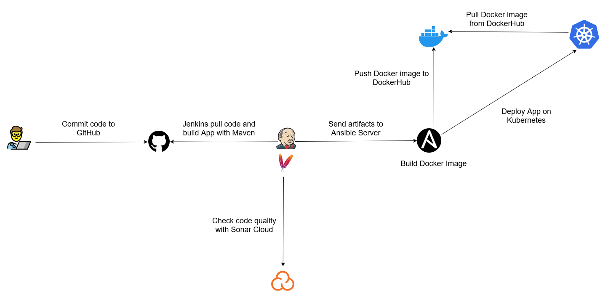
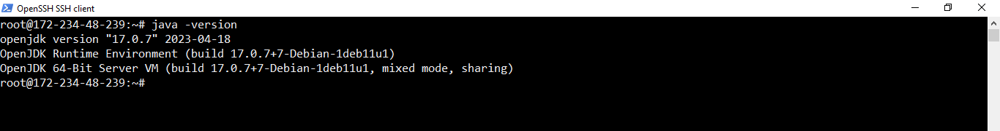
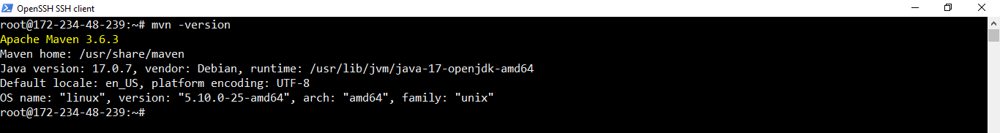

# Complete CI/CD Pipeline with Jenkins, GitHub, Ansible, Docker, Kubernetes

### Project Summary:

This project builds a step-by-step CI/CD pipeline for Spring Boot application (Pet-Clinic app):

- **GitHub (Source Code):** Collaborative version control via GitHub.
- **Jenkins (Continuous Integration):** Jenkins checks code quality using Sonar Cloud and builds Spring Boot app automatically using Maven.
- **Jenkins to Ansible (Artifact & Docker Images):** Jenkins sends files to Ansible, which makes Docker images and shares them on Docker Hub.
- **Ansible to Kubernetes (Deployment):** Ansible puts these images into Kubernetes, making sure our app runs well and can handle growth.

**Project GitHub Repository**: https://github.com/kyawzawaungdevops/Pet-Clinic-App-CICD-pipeline.git

**Final Deployed Application URL**: [](https://kyawzawaung.site/)[http://143-42-79-43.ip.linodeusercontent.com/](http://143-42-79-43.ip.linodeusercontent.com/)

### Pipeline Architecture



### **Project Steps**

- **Prepare Jenkins Server**
    - **Launch Jenkins Instance and sign in**
        
        Create a Jenkins Instance in Linode by choosing in Marketplace.
        
        
        
        
        
        Access Jenkins from its public IP via browser and Install plugins by choosing “Installed suggested plugins”
        
        
        
        
        
        Create Admin user
        
        
        
        
        
        Set the Jenkins server’s URL
        
        
        
        Now, Jenkins setup is complete and it is ready to be used.
        
        
        
        Sign in to Jenkins
        
        
        
        
        
    - **Install Java and Maven**
        
        Install Java 17 on Jenkins Server
        
        ```bash
        $ sudo apt update
        $ sudo apt install openjdk-17-jdk
        $ java -version
        ```
        
        
        
        Install Maven on Jenkins Server
        
        ```bash
        $ sudo apt update
        $ sudo apt install maven
        $ mvn -version
        ```
        
        
        
- **Prepare Ansible Server**
    
    Launch a Linode instance for Ansible server
    
    
    
    Install Ansible on the instance
    
    ```bash
    $sudo apt update
    $sudo apt install ansible
    ```
    
    Install Docker Engine on the instance (Docker image will be built in the Ansible server)
    
    ```bash
    $sudo apt update
    $sudo apt install apt-transport-https ca-certificates curl software-properties-common
    $curl -fsSL https://download.docker.com/linux/ubuntu/gpg | sudo apt-key add -
    $sudo add-apt-repository "deb [arch=amd64] https://download.docker.com/linux/ubuntu bionic stable"
    $sudo apt update
    $apt-cache policy docker-ce
    $sudo apt install docker-ce
    $sudo systemctl status docker
    ```
    
- **Prepare Kubernetes Cluster**
    
    Create a Kubernetes Cluster on Linode platform.
    
    
    
    
    
    
    
    
    
    
    
- **Sonar Cloud Setup**
    
    Access [https://sonarcloud.io](https://sonarcloud.io) and log in.
    
    
    
    Click Profile at the upper-right corner and choose “Analyze new project”.
    
    
    
    Choose “create a project manually.”
    
    
    
    Add Display Name and Project Key will be displayed automatically.
    
    <aside>
    💡 The Project Key will be required in Jenkins pipeline stage of scanning repository with Sonar Cloud.
    
    </aside>
    
    
    
    Then, choose Public in this project for project visibility and click Next.
    
    
    
    
    
    Now, a new project is created for Pet Clinic application
    
    
    
    Then, install SonarQube Scanner plugin on Jenkins server.
    
    
    
- **Prepare Jenkins pipeline and Dockerfile**
    - **Jenkins Pipeline Stage(Sonar Cloud scan)**
        - **Add Sonar Cloud token as a credential in Jenkins.**
            
            We will add Sonar Cloud token as a credentials in Jenkins.
            
            <aside>
            💡 The credential (Sonar Cloud token) will be used by Jenkins to connect to Sonar Cloud for scanning the repository in this stage.
            
            </aside>
            
            
            
            
            
            
            
        - **Prepare Jenkins pipeline script**
            
            Write Jenkins pipeline script (Jenkinsfile) for the stage and commit to GitHub repository.
            
            ```bash
            pipeline {
                agent any
                environment {
                    // Define environment variables
                    SONAR_TOKEN = credentials('Sonar_Token')
                }
                stages {
                    stage('Repo Scan using Sonarcloud') {
                        steps {
                            script {
                                env.SONAR_TOKEN = SONAR_TOKEN
                                sh """
                                    ./mvnw sonar:sonar \\
                                    -Dsonar.projectKey=devops-projectslabs_pet-clinic-app-cicd-pipeline \\
                                    -Dsonar.organization=devops-projectslabs \\
                                    -Dsonar.host.url=https://sonarcloud.io \\
                                    -Dsonar.login=\${SONAR_TOKEN}
                                """
                            }
                        }
                    }
                }
            }
            ```
            
        - **Create Jenkins pipeline**
            
            Enter the pipeline name “Pet-Clinic-App-CICD-pipeline” and choose pipeline.
            
            
            
            Choose pipeline script from SCM and GIt for SCM.
            
            Add Repository URL and choose none for Credentials as the repository is public. If a repository is private, we need credentials.
            
            
            
            Add “main” for branch to build and click “Save”.
            
        - **Run Jenkins pipeline**
            
            Click “Build Now” on the left side. The pipe will start running and Sonar Cloud will start to scan the repository and generate results. 
            
            
            
        - **Check Sonar Cloud Code Scan result**
            
            We can check the code scan result in our related project in Sonar Cloud as below.
            
            
            
            
            
    - **Jenkins Pipeline Stage (Build app with Maven and write Dockerfile)**
        - **Prepare Jenkins pipeline script**
            
            Write and modify Jenkins pipeline script (Jenkinsfile) for the stage and commit to GitHub repository.
            
            ```groovy
            pipeline {
                agent any
                environment {
                    // Define environment variables
                    SONAR_TOKEN = credentials('Sonar_Token')
                }
                stages {
                    stage('Repo Scan using Sonarcloud') {
                        steps {
                            script {
                                env.SONAR_TOKEN = SONAR_TOKEN
                                sh """
                                    ./mvnw sonar:sonar \\
                                    -Dsonar.projectKey=devops-projectslabs_pet-clinic-app-cicd-pipeline \\
                                    -Dsonar.organization=devops-projectslabs \\
                                    -Dsonar.host.url=https://sonarcloud.io \\
                                    -Dsonar.login=\${SONAR_TOKEN}
                                """
                            }
                        }
                    }
                    
                    stage('Pet clinic build using Maven') {
                        steps {
                            script {
                                sh "./mvnw clean install"
                            }
                        }
                    }
                }
            }
            ```
            
        - **Run Jenkins pipeline**
            
            Click “Build Now” on the left side. The pipe will start running and Maven will build the application as jar file. 
            
            
            
        - **Prepare Dockerfile**
            
            Dockerfile
            
            ```docker
            FROM openjdk:22-jdk-bullseye
            
            RUN mkdir -p /home/app
            
            WORKDIR /home/app
            COPY ./spring-petclinic-3.1.0-SNAPSHOT.jar /home/app
            
            EXPOSE 8080
            
            CMD ["java", "-jar", "spring-petclinic-3.1.0-SNAPSHOT.jar"]
            ```
            
    - **Jenkins Pipeline Stage  (SendDockerfile to the Ansible server over SSH by Jenkins and build Docker image)**
        - **Installing required services for copying files and build Docker image script**
            
            Jenkins server will send built app and Dockerfile to Ansible server on SSH. So, we will install required services for that.
            
            Install Open SSH client
            
            ```bash
            $sudo apt-get install openssh-client
            ```
            
            
            
            Install SSHPass
            
            ```bash
            sudo apt-get install sshpass
            ```
            
            
            
            Install Expect
            
            ```bash
            sudo apt-get install expect
            ```
            
            
            
        - **Prepare Jenkins pipeline script**
            
            Write and modify Jenkins pipeline script (Jenkinsfile) for the stage and commit to GitHub repository.
            
            ```groovy
            pipeline {
                agent any
                environment {
                    // Define environment variables
                    SONAR_TOKEN = credentials('Sonar_Token')
                    SSH_USERNAME = 'username'
                    SSH_PASSWORD = 'Your_SSH_Password'
                    SSH_HOST = 'YOur_SSH_HOST'
                }
                stages {
                    stage('Repo Scan using Sonarcloud') {
                        steps {
                            script {
                                env.SONAR_TOKEN = SONAR_TOKEN
                                sh """
                                    ./mvnw sonar:sonar \\
                                    -Dsonar.projectKey=devops-projectslabs_pet-clinic-app-cicd-pipeline \\
                                    -Dsonar.organization=devops-projectslabs \\
                                    -Dsonar.host.url=https://sonarcloud.io \\
                                    -Dsonar.login=\${SONAR_TOKEN}
                                """
                            }
                        }
                    }
                    stage('Pet clinic build using Maven') {
                        steps {
                            script {
                                sh "./mvnw clean install"
                            }
                        }
                    }
                    stage('Send Dockerfile to the Ansible server over SSH by Jenkins and build Docker image') {
                        steps {
                            script {
                                // Use sshpass to provide the SSH password and copy files to the remote server
                                sh "sshpass -p '${SSH_PASSWORD}' scp -r /var/lib/jenkins/workspace/Pet-Clinic-App-CICD-pipeline/target/* ${SSH_USERNAME}@${SSH_HOST}:/var/lib/app"
                                // Convert the repository name and tag to lowercase
                                def lowercaseRepoName = "testingkyaw/${JOB_NAME}".toLowerCase()
                                def lowercaseTag = "v1.${BUILD_ID}".toLowerCase()
                                def latestTag = "latest"
                                // SSH into the remote server to build the Docker image
                                def sshCommand = """
                                    sshpass -p '${SSH_PASSWORD}' ssh -o StrictHostKeyChecking=no ${SSH_USERNAME}@${SSH_HOST} <<EOF
                                    cd /var/lib/app
                                    docker build -t ${lowercaseRepoName}:${lowercaseTag} .
                                    docker build -t ${lowercaseRepoName}:${latestTag} .
                                    exit
            EOF
            """
                                sh "${sshCommand}"
                            }
                        }
                    }
                }
            }
            ```
            
        - **Run Jenkins pipeline**
            
            Click “Build Now” on the left side. The pipe will start running and the built app files and Dockerfile will be copied to Ansible server. 
            
            Then, Dockerfile will be build as Docker image on Ansible server.
            
            
            
    - **Jenkins Pipeline Stage (Push Docker image to Docker Hub)**
        - **Add Docker Credentials to Jenkins**
            
            Add Docker username and password to Credentials in Jenkins as “username and password”.
            
        - **Prepare Jenkins pipeline script**
            
            Write and modify Jenkins pipeline script (Jenkinsfile) for the stage and commit to GitHub repository.
            
            ```groovy
            pipeline {
                agent any
                environment {
                    // Define environment variables
                    SONAR_TOKEN = credentials('Sonar_Token')
                    SSH_USERNAME = 'username'
                    SSH_PASSWORD = 'Your_SSH_Password'
                    SSH_HOST = 'Your_SSH_HOST'
                }
                stages {
                    stage('Repo Scan using Sonarcloud') {
                        steps {
                            script {
                                env.SONAR_TOKEN = SONAR_TOKEN
                                sh """
                                    ./mvnw sonar:sonar \\
                                    -Dsonar.projectKey=devops-projectslabs_pet-clinic-app-cicd-pipeline \\
                                    -Dsonar.organization=devops-projectslabs \\
                                    -Dsonar.host.url=https://sonarcloud.io \\
                                    -Dsonar.login=\${SONAR_TOKEN}
                                """
                            }
                        }
                    }
                    stage('Pet clinic build using Maven') {
                        steps {
                            script {
                                sh "./mvnw clean install"
                            }
                        }
                    }
                    stage('Send Dockerfile to the Ansible server over SSH by Jenkins and build Docker image') {
                        steps {
                            script {
                                // Use sshpass to provide the SSH password and copy files to the remote server
                                sh "sshpass -p '${SSH_PASSWORD}' scp -r /var/lib/jenkins/workspace/Pet-Clinic-App-CICD-pipeline/target/* ${SSH_USERNAME}@${SSH_HOST}:/var/lib/app"
                                // Convert the repository name and tag to lowercase
                                def lowercaseRepoName = "testingkyaw/${JOB_NAME}".toLowerCase()
                                def lowercaseTag = "v1.${BUILD_ID}".toLowerCase()
                                def latestTag = "latest"
                                // SSH into the remote server to build the Docker image
                                def sshCommand = """
                                    sshpass -p '${SSH_PASSWORD}' ssh -o StrictHostKeyChecking=no ${SSH_USERNAME}@${SSH_HOST} <<EOF
                                    cd /var/lib/app
                                    docker build -t ${lowercaseRepoName}:${lowercaseTag} .
                                    docker build -t ${lowercaseRepoName}:${latestTag} .
                                    exit
            EOF
            """
                                sh "${sshCommand}"
                            }
                        }
                    }
                    
                    stage('Push Docker image to Docker Hub') {
                        steps {
                            withCredentials([string(credentialsId: 'Docker_Password', variable: 'Docker_Password')]) {
                                script {
                                    // Convert the repository name and tag to lowercase
                                    def lowercaseRepoName = "testingkyaw/${JOB_NAME}".toLowerCase()
                                    def lowercaseTag = "v1.${BUILD_ID}".toLowerCase()
                                    def latestTag = "latest"
                                    // SSH into the remote server to push the Docker image
                                    def sshCommand = """
                                        sshpass -p '${SSH_PASSWORD}' ssh -o StrictHostKeyChecking=no ${SSH_USERNAME}@${SSH_HOST} <<EOF
                                        docker login -u testingkyaw -p \${Docker_Password}
                                        docker push ${lowercaseRepoName}:${lowercaseTag}
                                        docker push ${lowercaseRepoName}:${latestTag}
                                        exit
            EOF
            """
                                    sh "${sshCommand}"
                                }
                            }
                        }
                    }
                }
            }
            ```
            
        - **Run Jenkins pipeline**
            
            Click “Build Now” on the left side. The pipe will start running and the Docker image will be pushed to DockerHub repository.
            
            
            
            We can check the Docker image in our DockerHub repository.
            
            
            
    - **Jenkins Pipeline Stage (Deploy app to Kubernetes from Ansible server)**
        - **Prepare Kubectl client on Ansible server**
            
            Install Kubectl on Ansible Server
            
            
            
            Create kubeconfig.yaml file in Ansible server to authenticate and communicate with the Kubernetes cluster created.
            
            
            
            Export kubeconfig.yaml as KUBECONFIG environment variable on Ansible server.
            
            
            
        - **Prepare Kubernetes manifest files**
            
            Write Kubernetes manifest files and commit to GitHub repository
            
            deployment.yaml
            
            ```yaml
            kind: Deployment
            apiVersion: apps/v1
            metadata:
               name: webapp-deployment
            spec:
               replicas: 3
               selector:     
                  matchLabels:
                     app: webapp-deployment
               template:
                  metadata:
                     labels:
                        app: webapp-deployment
                  spec:
                     containers:
                        - name: webapp-deployment
                          image: testingkyaw/pet-clinic-app-cicd-pipeline:v1.105
                          imagePullPolicy: Always
                          ports:
                           - containerPort: 8080
            ```
            
            Service.yaml
            
            ```yaml
            kind: Service                             
            apiVersion: v1
            metadata:
              name: webapp-deployment
              labels:
                app: webapp-deployment
            spec:
              ports:
                - port: 80                        
                  targetPort: 8080
                  nodePort: 32148
              selector:
                app: webapp-deployment                    
              type: LoadBalancer
            ```
            
        - **Prepare Ansible playbook file**
            
            Write Ansible playbook file for app deployment on Kubernetes Cluster
            
            ansible.yaml
            
            ```bash
            - hosts: all
              become: true
              tasks: 
                 - name: delete old deployment
                   command: kubectl delete -f /home/ubuntu/Deployment.yml
                 - name: delete old service
                   command: kubectl delete -f /home/ubuntu/Service.yml
                 - name: create new deployment
                   command: kubectl apply -f /home/ubuntu/Deployment.yml
                 - name: create new service
                   command: kubectl apply -f /home/ubuntu/Service.yml
            ```
            
        - **Prepare Jenkins pipeline script**
            
            Write and modify Jenkins pipeline script (Jenkinsfile) for the stage and commit to GitHub repository.
            
            ```groovy
            pipeline {
                agent any
                environment {
                    // Define environment variables
                    SONAR_TOKEN = credentials('Sonar_Token')
                    SSH_USERNAME = 'root'
                    SSH_PASSWORD = 'Cisco123@cisco'
                    SSH_HOST = '172.234.49.203'
                }
                stages {
                    stage('Repo Scan using Sonarcloud') {
                        steps {
                            script {
                                env.SONAR_TOKEN = SONAR_TOKEN
                                sh """
                                    ./mvnw sonar:sonar \\
                                    -Dsonar.projectKey=devops-projectslabs_pet-clinic-app-cicd-pipeline \\
                                    -Dsonar.organization=devops-projectslabs \\
                                    -Dsonar.host.url=https://sonarcloud.io \\
                                    -Dsonar.login=\${SONAR_TOKEN}
                                """
                            }
                        }
                    }
                    stage('Pet clinic build using Maven') {
                        steps {
                            script {
                                sh "./mvnw clean install"
                            }
                        }
                    }
            
                stage('SendDockerfile to the Ansible server over SSH by Jenkins and build Docker image') {
                        steps {
                            script {
                                // Use sshpass to provide the SSH password and copy files to the remote server
                                sh "sshpass -p '${SSH_PASSWORD}' scp -r /var/lib/jenkins/workspace/Pet-Clinic-App-CICD-pipeline/target/* ${SSH_USERNAME}@${SSH_HOST}:/var/lib/app"
                                // Convert the repository name and tag to lowercase
                                def lowercaseRepoName = "testingkyaw/${JOB_NAME}".toLowerCase()
                                def lowercaseTag = "v1.${BUILD_ID}".toLowerCase()
                                def latestTag = "latest"
                                // SSH into the remote server to build the Docker image
                                def sshCommand = """
                                    sshpass -p '${SSH_PASSWORD}' ssh -o StrictHostKeyChecking=no ${SSH_USERNAME}@${SSH_HOST} <<EOF
                                    cd /var/lib/app
                                    docker build -t ${lowercaseRepoName}:${lowercaseTag} .
                                    docker build -t ${lowercaseRepoName}:${latestTag} .
                                    exit
            EOF
            """
                                sh "${sshCommand}"
                            }
                        }
                    }
            
                stage('Push Docker image to Docker Hub') {
                        steps {
                            withCredentials([string(credentialsId: 'Docker_Password', variable: 'Docker_Password')]) {
                                script {
                                    // Convert the repository name and tag to lowercase
                                    def lowercaseRepoName = "testingkyaw/${JOB_NAME}".toLowerCase()
                                    def lowercaseTag = "v1.${BUILD_ID}".toLowerCase()
                                    def latestTag = "latest"
                                    // SSH into the remote server to push the Docker image
                                    def sshCommand = """
                                        sshpass -p '${SSH_PASSWORD}' ssh -o StrictHostKeyChecking=no ${SSH_USERNAME}@${SSH_HOST} <<EOF
                                        docker login -u testingkyaw -p \${Docker_Password}
                                        docker push ${lowercaseRepoName}:${lowercaseTag}
                                        docker push ${lowercaseRepoName}:${latestTag}
                                        exit
            EOF
            """
                                    sh "${sshCommand}"
                                }
                            }
                        }
                    }
            
                   stage('Deploying Kubernetes Manifests on Ansible Server over SSH by Jenkins') {
                        steps {
                            script {
                                // Use sshpass to provide the SSH password and copy files to the remote server
                                sh "sshpass -p '${SSH_PASSWORD}' scp -r /var/lib/jenkins/workspace/Pet-Clinic-App-CICD-pipeline/Kubernetes/* ${SSH_USERNAME}@${SSH_HOST}:/var/lib/app"
                                def sshCommand = """
                                    sshpass -p '${SSH_PASSWORD}' ssh -o StrictHostKeyChecking=no ${SSH_USERNAME}@${SSH_HOST} <<EOF
                                    cd /var/lib/app
                                    export KUBECONFIG=/root/kubeconfig.yaml
                                    //kubectl apply -f deployment.yaml
                                    //kubectl apply -f service.yaml
                                    //ansible-playbook -i inventory.ini ansible.yaml
                                    ansible-playbook -i localhost_inventory.yaml ansible.yaml
                                    exit
            EOF
            """
                                sh "${sshCommand}"
                            }
                        }
                    }
            
                }
            }
            ```
            
        - **Run Jenkins pipeline**
            
            Click “Build Now” on the left side. The piplinee will start running and Ansible server will apply Kubernetes manifest files and the application pods and service will be applied.
            
            
            
            Output of running ansible.yaml file
            
            
            
- **Run complete Jenkins pipeline**
    
    Complete Jenkins pipeline script
    
    ```bash
    pipeline {
        agent any
        environment {
            // Define environment variables
            SONAR_TOKEN = credentials('Sonar_Token')
            SSH_USERNAME = 'root'
            SSH_PASSWORD = 'Cisco123@cisco'
            SSH_HOST = '172.234.49.203'
        }
        stages {
            stage('Repo Scan using Sonarcloud') {
                steps {
                    script {
                        env.SONAR_TOKEN = SONAR_TOKEN
                        sh """
                            ./mvnw sonar:sonar \\
                            -Dsonar.projectKey=devops-projectslabs_pet-clinic-app-cicd-pipeline \\
                            -Dsonar.organization=devops-projectslabs \\
                            -Dsonar.host.url=https://sonarcloud.io \\
                            -Dsonar.login=\${SONAR_TOKEN}
                        """
                    }
                }
            }
            stage('Pet clinic build using Maven') {
                steps {
                    script {
                        sh "./mvnw clean install"
                    }
                }
            }
    
        stage('SendDockerfile to the Ansible server over SSH by Jenkins and build Docker image') {
                steps {
                    script {
                        // Use sshpass to provide the SSH password and copy files to the remote server
                        sh "sshpass -p '${SSH_PASSWORD}' scp -r /var/lib/jenkins/workspace/Pet-Clinic-App-CICD-pipeline/target/* ${SSH_USERNAME}@${SSH_HOST}:/var/lib/app"
                        // Convert the repository name and tag to lowercase
                        def lowercaseRepoName = "testingkyaw/${JOB_NAME}".toLowerCase()
                        def lowercaseTag = "v1.${BUILD_ID}".toLowerCase()
                        def latestTag = "latest"
                        // SSH into the remote server to build the Docker image
                        def sshCommand = """
                            sshpass -p '${SSH_PASSWORD}' ssh -o StrictHostKeyChecking=no ${SSH_USERNAME}@${SSH_HOST} <<EOF
                            cd /var/lib/app
                            docker build -t ${lowercaseRepoName}:${lowercaseTag} .
                            docker build -t ${lowercaseRepoName}:${latestTag} .
                            exit
    EOF
    """
                        sh "${sshCommand}"
                    }
                }
            }
    
        stage('Push Docker image to Docker Hub') {
                steps {
                    withCredentials([string(credentialsId: 'Docker_Password', variable: 'Docker_Password')]) {
                        script {
                            // Convert the repository name and tag to lowercase
                            def lowercaseRepoName = "testingkyaw/${JOB_NAME}".toLowerCase()
                            def lowercaseTag = "v1.${BUILD_ID}".toLowerCase()
                            def latestTag = "latest"
                            // SSH into the remote server to push the Docker image
                            def sshCommand = """
                                sshpass -p '${SSH_PASSWORD}' ssh -o StrictHostKeyChecking=no ${SSH_USERNAME}@${SSH_HOST} <<EOF
                                docker login -u testingkyaw -p \${Docker_Password}
                                docker push ${lowercaseRepoName}:${lowercaseTag}
                                docker push ${lowercaseRepoName}:${latestTag}
                                exit
    EOF
    """
                            sh "${sshCommand}"
                        }
                    }
                }
            }
    
           stage('Deploying Kubernetes Manifests on Ansible Server over SSH by Jenkins') {
                steps {
                    script {
                        // Use sshpass to provide the SSH password and copy files to the remote server
                        sh "sshpass -p '${SSH_PASSWORD}' scp -r /var/lib/jenkins/workspace/Pet-Clinic-App-CICD-pipeline/Kubernetes/* ${SSH_USERNAME}@${SSH_HOST}:/var/lib/app"
                        def sshCommand = """
                            sshpass -p '${SSH_PASSWORD}' ssh -o StrictHostKeyChecking=no ${SSH_USERNAME}@${SSH_HOST} <<EOF
                            cd /var/lib/app
                            export KUBECONFIG=/root/kubeconfig.yaml
                            //kubectl apply -f deployment.yaml
                            //kubectl apply -f service.yaml
                            //ansible-playbook -i inventory.ini ansible.yaml
                            ansible-playbook -i localhost_inventory.yaml ansible.yaml
                            exit
    EOF
    """
                        sh "${sshCommand}"
                    }
                }
            }
    
        }
    }
    ```
    
    Now Let’s run the complete pipeline. Ansible server will apply Kubernetes manifest files and the application pods and service will be applied.
    
    
    
    We can check the pods and service(loadbalancer) running on Kubernets Cluster.
    
    Pods
    
    
    
    Services
    
    
    
- **Access deployed application**
    
    Access the deployed app via browser.
    
    Deployed application URL:[http://143-42-79-43.ip.linodeusercontent.com/](http://143-42-79-43.ip.linodeusercontent.com/)
    
    